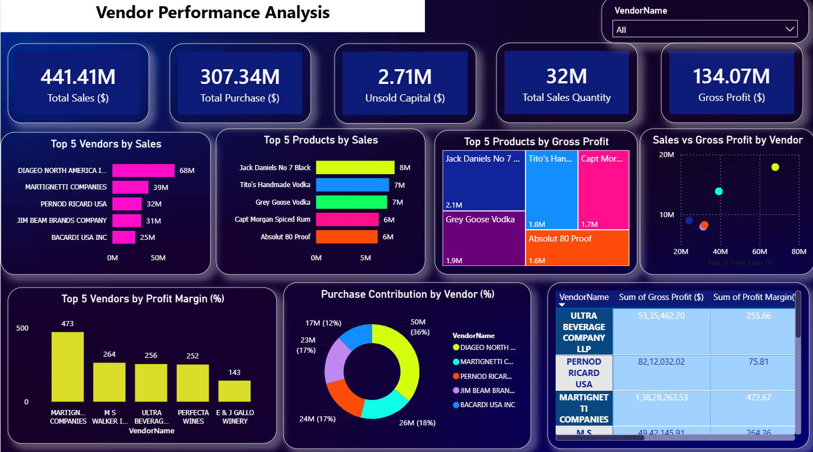

# Vendor Performance Analysis

## Project Overview

This is an end-to-end Data Analytics project developed using SQL, Python, Microsoft Excel, and Power BI. The project focuses on analyzing vendor performance by evaluating sales, purchases, gross profit, profit margin, inventory, and business performance through an interactive Power BI dashboard.

## Project Workflow

1. Collected a publicly available practice dataset.
2. Cleaned and transformed the raw data using Python.
3. Performed data analysis using SQL.
4. Exported the processed data to Microsoft Excel.
5. Built an interactive dashboard in Power BI.
6. Analyzed vendor performance and generated business insights.

## Tools & Technologies

- Python
- SQL
- Microsoft Excel
- Power BI

## Skills Demonstrated

- Data Cleaning
- Data Transformation
- SQL Querying
- Data Analysis
- Data Visualization
- Dashboard Development
- KPI Reporting
- Business Intelligence

## Dashboard KPIs

- Total Sales
- Total Purchase
- Gross Profit
- Profit Margin
- Unsold Capital
- Sales Quantity

## Dashboard Visualizations

- Top 5 Vendors by Sales
- Top 5 Products by Sales
- Top 5 Products by Gross Profit
- Sales vs Gross Profit by Vendor
- Top 5 Vendors by Profit Margin
- Purchase Contribution by Vendor
- Vendor Performance Table

## Business Insights

- Identified top-performing vendors based on sales and profit.
- Compared vendor purchases with sales performance.
- Analyzed product-wise sales and profitability.
- Evaluated profit margins across vendors.
- Measured purchase contribution by vendor.
- Identified unsold capital for better inventory management.
- Supported business decision-making using interactive dashboards.

## Dataset

This project uses a publicly available practice dataset for learning and educational purposes.

## Project Files

- vendor_performance_analysis_datasett.xlsx
- Vendor_Dashboard.png
- vendor performance analysis dashboard.pbix

## Dashboard Preview

## Author

Ankita Mehra
GitHub: https://github.com/Alphaankita
